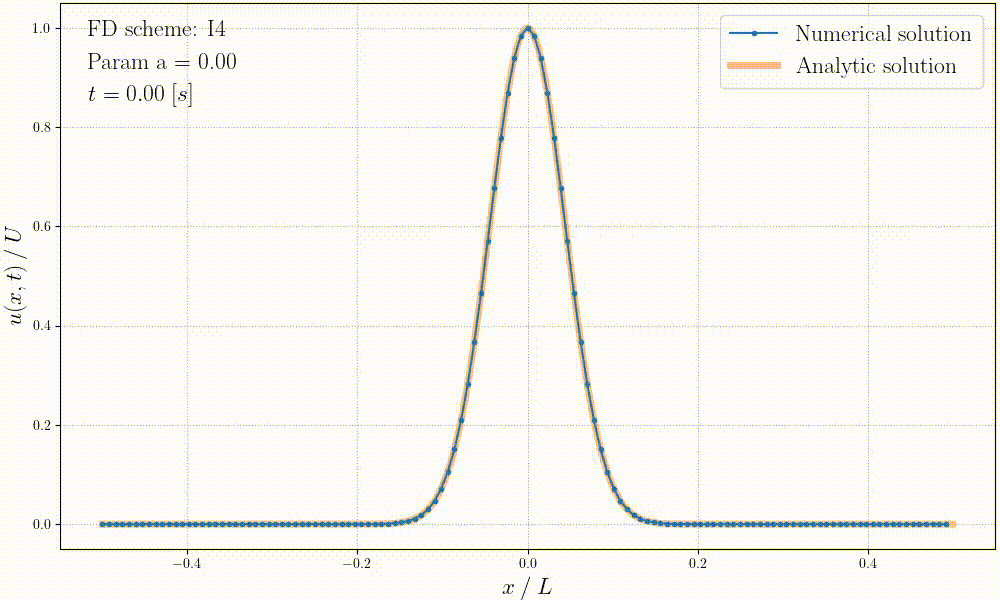

# Simulating convection - Homework LMECA2660

## Structure

    ├── README.md
    │
    ├── data               <- Raw results of the simulations
    ├── figures            <- Results of the analysis done with Pyhton scripts
    │
    ├── fd_solver.h        <- Parameters for the simulation (scheme, CFL, saving files, ...)
    ├── fd_solver.c        <- Implementation of the spatial schemes (E2, E4, ...)
    ├── thomas.h           <- Solver for a tridiagonal and periodic system
    ├── main.c             <- Simulate the convection
    │
    ├── run.py             <- Plots & animation of the results stored in data
    ├── theory.py          <- Plots about Fourier transform and dispersion relations
    │
    ├── instructions.pdf   <- Homework assignment
    └── report.pdf         <- Report answering the questions asked in the homework assignment

## Run the code
The code in __C__ can be compiled and executed as follows:
```
gcc -o hw main.c -lm
./hw
```

The scripts in __Python__ can be run as follows:
```
python3 script.py
```

## Example without stretching


## Example with stretching


## Upstream pulse error

