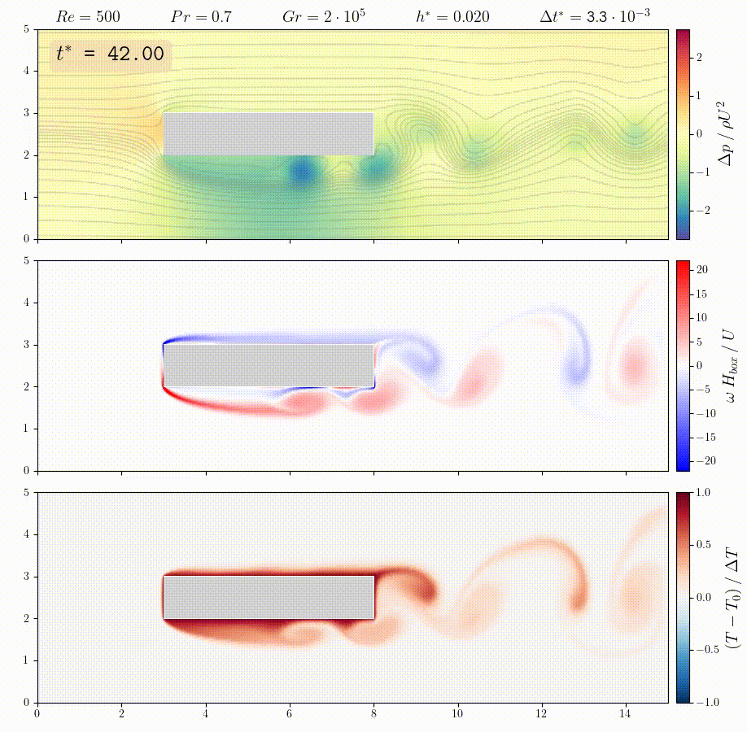

# 2D flow simulation - Project LMECA2660

This project was done in the course _Numerical methods in fluid mechanics_. It simulates a 2D flow around a (possibly) moving rectangular obstacle. Furthermore, the temperature field can be coupled with the velocity fields through natural convection under the Boussinesq approximation.


## Structure

    ├── README.md
    ├── Makefile
    │
    ├── anim              <- Animations in .mp4 format of different situations
    ├── doc               <- Documents, instructions, reference book
    ├── figures           <- Figures analyzing different simulations
    ├── include           <- Header files
    │   ├── project.h     <- Physical parameters (Re, Pr, ...) and solver settings (CFL, adaptive time step, ...)
    │   └── ...
    ├── lib_petsc         <- PETSc installation
    ├── report            <- Report in .tex and .pdf formats
    ├── results           <- Results of simulations saved in .txt files
    ├── scripts           <- Post-processing of the simulations: analysis with figures, and video generation
    └── src               <- Source code in .c files

## Run the code
The code in `C` can be compiled easily with `make`, and then executed as follows:
```
make -j
./cfd -ksp_type fgmres -pc_type lu -n 50 -dt 0.002 -tend 50. -freq 0.1 -dir new_case
```

- __-ksp_type__ : Name of the PETSc Krylov method, that shouldn't be modified
- __-pc_type__ : Name of the PETSc preconditioner method, that shouldn't be modified
- __-n__ [integer] : Number of spatial steps per obstacle height, called Hbox
- __-dt__ [double] : Time step, or initial time step if adaptive time step activated
- __-tend__ [double] : Final time of the simulation
- __-freq__ [double] : Frequency to which the program saves the fields in `.txt` files
- __-dir__ : Name of the subdirectory created or overwritten in `./results/` directory


## Produce an animation
The animation proposed shows the streamlines (iso-psi), the pressure field, the vorticity field and if possible the temperature field.

First, make sure that you have the results of a simulation stored in the directory `./results/<name>`. Then, execute the following command inside the directory `./scripts/` with the format of your choice for the flag `-save`:
```
python3 run.py -dir <name> -save <none, gif, mp4, html>
```

If you used `html`, and want to produce a video based on the successive frames just created, you can use `FFmpeg` as follows:
```
ffmpeg -framerate 25 -i <name>/frame_%05d.png -vcodec libx264 -vf "pad=ceil(iw/2)*2:ceil(ih/2)*2" -crf 5 -r 25 -pix_fmt yuv420p <name>.mp4
```

If you want to convert a `.mp4` to a `.gif`:
```
ffmpeg -ss 0.0 -t 9.5 -i input.mp4 -f gif output.gif
```

## Dependencies
The solver uses the PETSc library in order to solve the poisson equation of the projection method. Instructions for installing are available in the `./doc/` directory. More details about an optimized compilation are given on the website https://petsc.org/release/install/install/#compilers.

## Example 1


## Example 2


## Example 3


