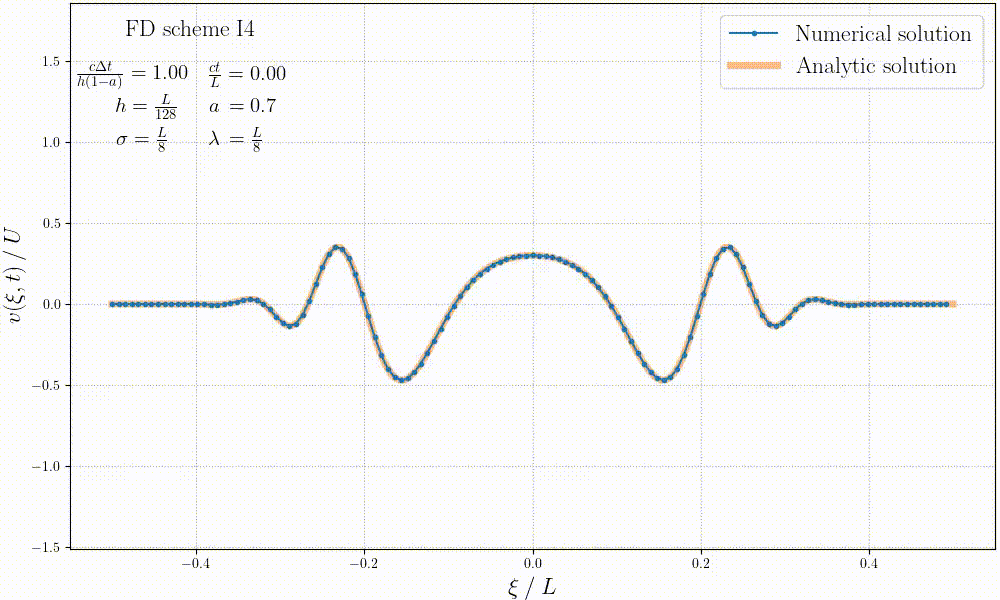

# Numerical methods in fluid mechanics - LMECA2660

## Homework
Simulate convection in 1D with FDM. More details in `Homework/README.md`.  

## Project - Navier-stokes
Simulate Navier-stokes equations in 2D with FDM. More details in `Project/README.md`.

